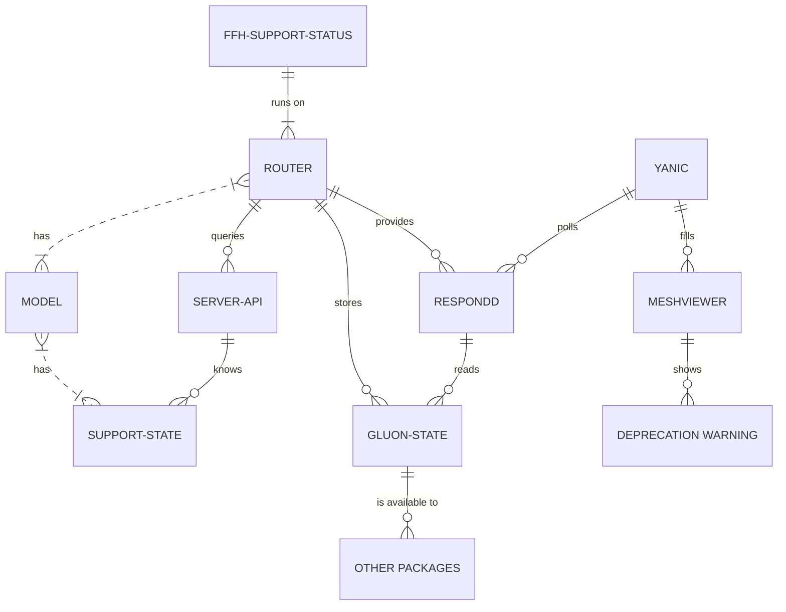

# ffh-support-status

This module asks a server about its models current support status
in gluon in regular intervals:

- one hour, if something went wrong fetching the server last time
- seven days if the device was last marked as supported
- one day if not

It stores the result as gluon state `support-state` and reports
this as nodeinfo provider.

The format is the following:

```json
{
  "nodeinfo": {
    "support-state": 0
  }
}
```
The number of `support-state` represents indexes of the following enum:

- 0 -> unsupported
- 1 -> upcoming
- 2 -> deprecated
- 3 -> supported
- 4 -> unknown

Viewed as bits the least significant one represents support on gluons master,
the second does indicate support on the stable branch,
and the third is only active if something went wrong fetching the support state.

While the two LSB are meant for stable and master,
the queried server could reflect any two points in gluons history.
A community could even map them to their latest (possibly patched)
stable release and a beta or even nightly firmware.

## data source

Determining whether a model is supported is an information that's currently
only available in gluons repo and requires execution or extensive pattern
matching on the scattered (lua) target files.

The info effective at build time would be outdated soon enough to not bother
compiling it into the packages sources.

## context

The following diagram shows how this package, the support-state,
and finally the warning in the meshviewer are related to each other.

As storage gluon-state is used, which has the benefit of providing
other software like EOL-SSID packages or similar.


